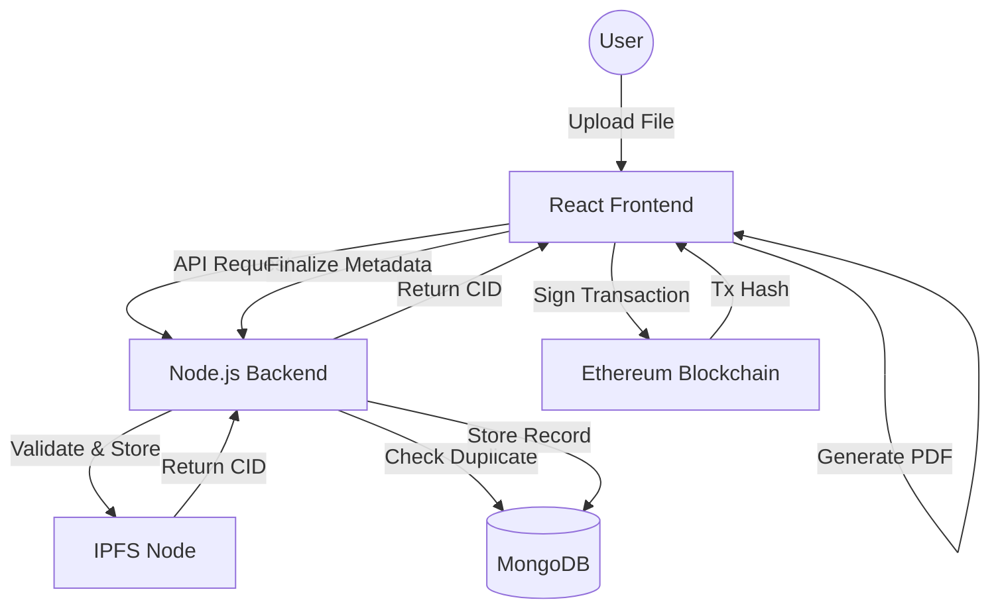

# Notarion 📜

**Notarion** is a professional-grade, full-stack decentralized application (dApp) designed to provide immutable proof of existence for digital assets. By leveraging **IPFS** for decentralized storage and the **Ethereum blockchain** for anchoring, Notarion ensures that your files are secure, verifiable, and permanent.

---

## 🚀 Key Features

- 🔒 **Immutable Anchoring**: CID (Content Identifier) stored on-chain via a burn address—permanent proof without central authority.
- 📂 **Decentralized Storage**: Files are uploaded to a local IPFS node, ensuring data sovereignty.
- 📜 **Digital Certificates**: Generate and download a professional PDF transaction certificate for every notarization.
- 🔄 **Resilient Workflow**: Built-in retry logic for both blockchain transactions and database synchronization.
- 🔍 **Smart Deduplication**: Backend CID checks prevent redundant uploads and unnecessary gas fees.
- 🌍 **Global Ready**: Fully localized in English and Italian with automatic language detection.
- 🐳 **One-Click Deployment**: Entire stack (UI, API, IPFS, MongoDB) pre-configured with Docker Compose.
- 🛡️ **Enterprise Security**: Magic-byte MIME validation, strict rate limiting, and end-to-end TypeScript safety.

---

## 🛠️ Architecture

Notarion follows a modern distributed architecture to balance performance with decentralization.



---

## 🚦 Quick Start

### 📋 Prerequisites

- **Node.js**: v20+
- **Docker & Docker Compose**
- **MetaMask**: Browser extension installed and configured.

### 🐳 Option 1: Docker (Recommended)

Run the entire ecosystem with a single command:

```bash
# 1. Clone & Enter
git clone <repository-url>
cd notarion

# 2. Configure
cp .env.example .env

# 3. Launch
docker compose up -d
```

| Service         | URL                                                        |
| :-------------- | :--------------------------------------------------------- |
| **Frontend UI** | [http://localhost:3000](http://localhost:3000)             |
| **Backend API** | [http://localhost:5002](http://localhost:5002)             |
| **IPFS Web UI** | [http://127.0.0.1:5001/webui](http://127.0.0.1:5001/webui) |

---

### 💻 Option 2: Manual Development

If you prefer to run services individually:

**1. Infrastructure**

```bash
docker compose up -d mongodb ipfs
```

**2. Backend**

```bash
cd server
npm install
npm start
```

**3. Frontend**

```bash
cd app
npm install
npm start
```

---

## 🔌 API Reference

### Upload & Management

| Method | Endpoint                   | Description                                      |
| :----- | :------------------------- | :----------------------------------------------- |
| `POST` | `/api/upload/ipfs`         | Upload file to IPFS (with magic-byte validation) |
| `POST` | `/api/upload`              | Save notarization metadata to MongoDB            |
| `GET`  | `/api/upload/cid/:cid`     | Retrieve notarization by CID                     |
| `GET`  | `/api/upload/wallet/:addr` | List all notarizations for a specific wallet     |
| `GET`  | `/health`                  | System health status                             |

---

## 🔐 Security & Reliability

- **MIME Validation**: We don't trust file extensions. The backend inspects file headers using magic bytes to ensure content integrity.
- **Rate Limiting**: Protected against abuse with tiered limits (100 req/15min for general API, 10 req/15min for uploads).
- **Persistent State**: Notarization progress is tracked in `sessionStorage` and `localStorage`, allowing you to resume after a page refresh or wallet disconnect.
- **Sanitized Headers**: Uses `Helmet` to protect against common web vulnerabilities.

---

## 🤝 Contributing

Contributions are welcome! Please see [CONTRIBUTING.md](CONTRIBUTING.md) for guidelines on how to get started.

## 🔐 Security

If you discover a security vulnerability, please see our [Security Policy](SECURITY.md) for responsible disclosure instructions.

## 📝 License

Distributed under the MIT License. See [LICENSE](LICENSE) for more information.

---

## 👤 Author

**Salvatore Corvaglia**

- GitHub: [@salvatorecorvaglia](https://github.com/salvatorecorvaglia)
